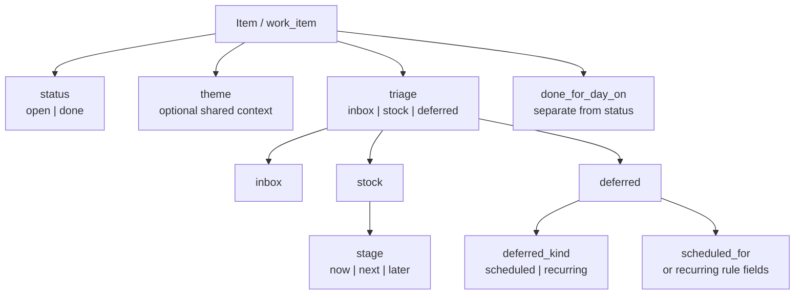

# Data Model

## Goal

Describe the current in-memory domain model used by the app.

## Core Item

The main runtime type is `Item` in [src/model.go](/Users/m2tkl/repos/github.com/m2tkl/workbench/src/model.go).

Each item carries:

- identity: `id`, `title`
- planning context: `theme`, `refs`
- workflow fields: `triage`, `stage`, `deferred_kind`
- supporting content: main note, manual notes, context snippets, log snippets
- lifecycle fields: `status`, `done_for_day_on`
- scheduling fields: `scheduled_for`, recurring fields
- audit fields: `created_at`, `updated_at`, `last_reviewed_on`, `log`

## Field Roles

### `status`

This answers whether the item is still alive.

- `open`
- `done`

Notes:

- `done_for_day_on` is not the same as `done`
- an item closed for the day still has `status == "open"`

### `triage`

This is the top-level action classification.

- `inbox`
- `stock`
- `deferred`

Meaning:

- `inbox`: not yet classified into active work
- `stock`: part of the normal actionable queue
- `deferred`: hidden behind a date or recurrence rule

### `stage`

This applies only when `triage == "stock"`.

- `now`
- `next`
- `later`

### `deferred_kind`

This applies only when `triage == "deferred"`.

- `scheduled`
- `recurring`

### `theme`

This is optional shared context for any work item.

## Valid Combinations

Valid workflow combinations are:

- inbox item: `triage=inbox`, `stage=""`, `deferred_kind=""`
- stock now: `triage=stock`, `stage=now`, `deferred_kind=""`
- stock next: `triage=stock`, `stage=next`, `deferred_kind=""`
- stock later: `triage=stock`, `stage=later`, `deferred_kind=""`
- deferred scheduled: `triage=deferred`, `stage=""`, `deferred_kind=scheduled`
- deferred recurring: `triage=deferred`, `stage=""`, `deferred_kind=recurring`

Invalid combinations should not be written by app logic.

## Derived Behavior

The UI derives sections from workflow fields rather than a separate bucket field.

Examples:

- `Inbox`: `triage == inbox`
- `Now`: `triage == stock && stage == now`
- `Next`: `triage == stock && stage == next`
- `Later`: `triage == stock && stage == later`
- `Deferred`: `triage == deferred`

## Visibility Rules

### Focus / Today

An item is visible today when:

- it is `stock/now`
- or it is currently active deferred work

### Done for Day

An item is "done for day" when:

- `status == open`
- `done_for_day_on == today`
- and it would otherwise be visible in today/focus

### Complete

An item is complete when:

- `status == done`

Recurring items are special:

- completing a recurring item usually closes only the current window
- it does not always transition to `status == done`

## Constructors and Mutations

Main constructors:

- `NewInboxItem(now, title)`
- `NewItem(now, title, triage, stage, deferredKind)`
- `NewStockItem(now, title, stage)`
- `NewScheduledItem(now, title, day)`
- `NewRecurringItem(now, title, everyDays, anchor)`

Legacy issue/task constructor names may still exist as compatibility shims, but new behavior is unified around `work_item`.

Main mutations:

- `MoveTo(now, triage, stage, deferredKind)`
- `SetScheduledFor(now, day)`
- `SetRecurring(...)`
- `SetRecurringRule(...)`
- `MarkDoneForDay(...)`
- `Complete(...)`
- `ReopenForToday(...)`
- `ReopenComplete(...)`

## Sorting

Items are sorted by:

1. `status`
2. workflow-specific urgency
3. `updated_at`
4. `title`
