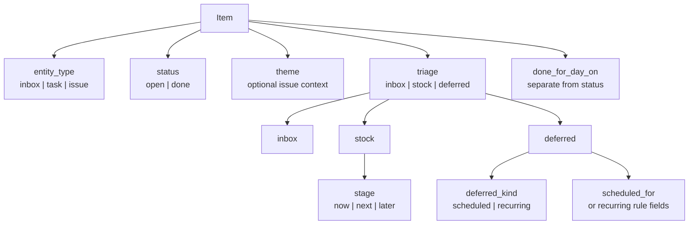

# Data Model

## Goal

Describe the current in-memory domain model used by the app.
This document explains how an item is classified, how action filters are derived, and how the model maps to the vault-backed store.

## Core Item

The main runtime type is `Item` in [src/model.go](/Users/m2tkl/repos/github.com/m2tkl/workbench/src/model.go).



Each item carries:

- identity: `id`, `title`
- type: `entity_type`
- planning context: `theme`, `refs`
- workflow fields: `triage`, `stage`, `deferred_kind`
- supporting content: primary note, memo snippets, context snippets, log snippets
- lifecycle fields: `status`, `done_for_day_on`
- scheduling fields: `scheduled_for`, recurring fields
- audit fields: `created_at`, `updated_at`, `last_reviewed_on`, `log`

## Field Roles

### `entity_type`

This answers what the item is structurally.

- `inbox`
- `task`
- `issue`

Meaning:

- `inbox` is unclassified capture
- `task` is ordinary execution work
- `issue` is longer-lived work that may carry a theme

### `status`

This answers whether the item is still alive.

- `open`
- `done`

Notes:

- `done_for_day_on` is not the same as `done`
- an item closed for the day still has `status == "open"`

### `triage`

This is the top-level action classification.

- `inbox`
- `stock`
- `deferred`

Meaning:

- `inbox`: not yet classified into active work
- `stock`: part of the normal actionable queue
- `deferred`: hidden behind a date or recurrence rule

### `stage`

This applies only when `triage == "stock"`.

- `now`
- `next`
- `later`

Meaning:

- `now`: active execution
- `next`: ready but not yet active
- `later`: intentionally kept out of the near queue

### `deferred_kind`

This applies only when `triage == "deferred"`.

- `scheduled`
- `recurring`

Meaning:

- `scheduled`: becomes active on or after `scheduled_for`
- `recurring`: becomes active when the recurrence rule says so

### `theme`

This is optional shared context for issues.

Rules:

- tasks may have an empty theme
- issues may have a theme or be unthemed
- `No Theme` in the UI means `theme == ""`

## Valid Combinations

The model intentionally separates the top-level classification from its substate.

Valid workflow combinations are:

- inbox item: `triage=inbox`, `stage=""`, `deferred_kind=""`
- stock now: `triage=stock`, `stage=now`, `deferred_kind=""`
- stock next: `triage=stock`, `stage=next`, `deferred_kind=""`
- stock later: `triage=stock`, `stage=later`, `deferred_kind=""`
- deferred scheduled: `triage=deferred`, `stage=""`, `deferred_kind=scheduled`
- deferred recurring: `triage=deferred`, `stage=""`, `deferred_kind=recurring`

Invalid combinations should not be written by app logic.
For example:

- `triage=stock` with empty `stage`
- `triage=deferred` with empty `deferred_kind`
- `triage=inbox` with non-empty `stage`

## Derived Behavior

The UI does not store a separate "placement" or "bucket" field.
Instead, action views are derived from the workflow fields.

Examples:

- `Inbox`: `triage == inbox`
- `Now`: `triage == stock && stage == now`
- `Next`: `triage == stock && stage == next`
- `Later`: `triage == stock && stage == later`
- `Deferred`: `triage == deferred`

The code paths for this live mostly in [src/app.go](/Users/m2tkl/repos/github.com/m2tkl/workbench/src/app.go).

## Visibility Rules

### Focus / Today

An item is visible today when:

- it is `stock/now`
- or it is currently active deferred work

Deferred activation rules:

- scheduled: `scheduled_for <= today`
- recurring: recurrence matches and the current window is not already complete

### Done for Day

An item is "done for day" when:

- `status == open`
- `done_for_day_on == today`
- and it would otherwise be visible in today/focus

### Complete

An item is complete when:

- `status == done`

Recurring items are special:

- completing a recurring item usually closes only the current window
- it does not always transition to `status == done`

## Constructors and Mutations

Main constructors:

- `NewInboxItem(now, title)`
- `NewItem(now, title, triage, stage, deferredKind)`
- `NewIssueItem(now, title, triage, stage, deferredKind)`
- `NewStockItem(now, title, stage)`
- `NewIssueStockItem(now, title, stage)`
- `NewScheduledItem(now, title, day)`
- `NewIssueScheduledItem(now, title, day)`
- `NewRecurringItem(now, title, everyDays, anchor)`
- `NewIssueRecurringItem(now, title, everyDays, anchor)`

Main mutations:

- `MoveTo(now, triage, stage, deferredKind)`
- `SetScheduledFor(now, day)`
- `SetRecurring(...)`
- `SetRecurringRule(...)`
- `MarkDoneForDay(...)`
- `Complete(...)`
- `ReopenForToday(...)`
- `ReopenComplete(...)`

Important rule:

- general movement uses `MoveTo`
- new code should prefer the specialized constructors for stock/scheduled/recurring items
- deferred state should usually be changed through `SetScheduledFor` or recurring helpers, not by setting fields manually

## Sorting

Items are sorted by:

1. `status`
2. workflow rank
3. `created_at`

Workflow rank is:

1. inbox
2. stock now
3. stock next
4. stock later
5. deferred scheduled
6. deferred recurring

## Vault Mapping

The current vault store does not persist one giant serialized `Item`.
It maps the runtime model onto separate file types.

### Inbox

Stored under `vault/inbox/`.

Mapped as:

- `entity_type = inbox`
- `triage = inbox`

### Task

Stored under `vault/tasks/<title-slug>--<id>/task.md`.

Mapped as:

- `entity_type = task`
- work state becomes `now` / `next` / `later`

### Issue

Stored under `vault/issues/<title-slug>--<id>/issue.md`.

Mapped as:

- `entity_type = issue`
- optional `theme`
- work state becomes `now` / `next` / `later`

### Theme

Stored separately under `vault/themes/<title-slug>--<id>/theme.md`.

Themes are not embedded into items.
Items link to themes by `theme` id only.

## Examples

### New inbox capture

```text
entity_type=inbox
status=open
triage=inbox
stage=""
deferred_kind=""
theme=""
```

### Task ready to do next

```text
entity_type=task
status=open
triage=stock
stage=next
deferred_kind=""
theme=""
```

### Issue in a theme

```text
entity_type=issue
status=open
triage=stock
stage=now
deferred_kind=""
theme=auth-stepup
```

### Scheduled task

```text
entity_type=task
status=open
triage=deferred
stage=""
deferred_kind=scheduled
scheduled_for=2026-04-20
```

## Naming Guidance

When discussing the model:

- use `status` for open vs done
- use `triage` for inbox vs stock vs deferred
- use `stage` for now vs next vs later
- use `deferred kind` for scheduled vs recurring

Avoid reintroducing umbrella names like "placement" unless there is a real new concept that needs one.
